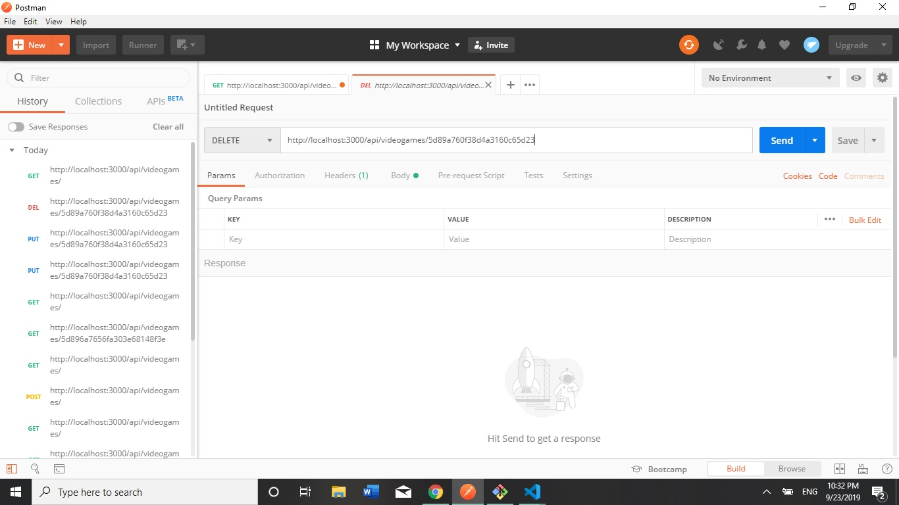

# LAB - 06

## Mongoose ORM

### Author: Jose Ojeda

### Links and Resources
* [submission PR](https://github.com/jose-401-advanced-javascript/mongoose-orm/pull/1)
* [travis](https://travis-ci.com/jose-401-advanced-javascript/mongoose-orm)

### Setup
#### `.env` requirements
* `PORT` - 3000
* `MONGODB_URI` - mongodb://localhost:27017/VideoGame

#### Running the app
Lifecycle scripts included in copy-file:
  start
    node server.js
  test
    jest --verbose

available via `npm run-script`:
  lint
    eslint **/*.js
  test-watch
    jest --verbose --watchAll
  jsdoc
    jsdoc -c ./docs/config/jsdoc.config.json
  
#### UML

